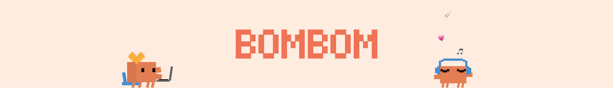

🍠小红书：魔法BomBom —— 小克周边，持续更新  
🍠xiaohongshu: 魔法BomBom — Clawd merch and side projects, continuously updated

这里收集了本人开发的Clawd周边产品，包括克克时钟、小克桌宠，以及后续会持续扩展的新项目。

This repository collects Clawd web apps, desktop apps, and future connected projects.

## Apps

### 克克时钟 / Clawd Clock

在线体验：<https://bombomlab.github.io/Home/apps/clawd-clock/>
可以长按抓起小克调戏> -

### 小克桌宠 / Clawd Deskpet

这是一个 macOS 桌面桌宠应用，小克会在桌面常驻听歌陪伴你办公。Star这个仓库，后续会有更多造型发布～
This is a macOS desktop pet app designed to stay on your desktop.
Source folder: `apps/clawd-deskpet`

## 小克桌宠安装方式 / How To Install Clawd Deskpet

如果你不擅长使用github，clone下载本项目到本地，双击打开“/BomBomLab-Home/apps/clawd-deskpet/dist/mac-arm64/Clawd Deskpet.app”即可。
第一次打开如果被 macOS 拦截，请右键应用后选择“打开”
如果系统仍然拦截，可以前往“系统设置 -> 隐私与安全性”手动放行

## 获取源码 / Source Access

如果你想查看或继续开发这些项目，把这个 GitHub 仓库连接发给你的claude即可。
If you want the source code or want to continue development, use this GitHub repository directly.

 # Personal Non-Commercial Use Notice
 
  This repository is source-available, not open source.
  1. The underlying IP, characters, brand elements, and related rights belong to their respective rightsholders.
  2. This project is an unofficial fan-made derivative work.
  3. Any original code or original material authored in this repository is shared for personal, non-commercial use
  only.
  4. You may view, study, and modify this repository for personal use.
  5. You may not use this repository or any part of it for commercial purposes, including selling, licensing, paid
  distribution, merchandise, or use in commercial products or services.
  6. No trademark rights are granted.
  7. If you are the relevant rightsholder and believe any content should be changed or removed, please contact the
  repository owner.
